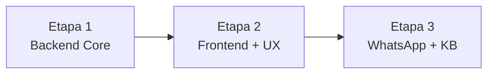

# PRD: Refatoração do Chatbot — Etapa 3: WhatsApp + Escalação + Knowledge Base

**Versão:** 1.0  
**Data:** 2026-05-09  
**Status:** 📋 Pronto para Implementação (após Etapas 1 e 2)  
**Escopo:** Cards 18.8, 19, 19.1, 19.2, 19.10  
**Dependência:** Etapas 1 e 2 devem estar concluídas

---

## 📋 1. Visão Geral

### Objetivo
Completar o módulo de chatbot com:
1. **Integração WhatsApp** — conectar webhook existente ao pipeline de chat
2. **Base de conhecimento** — organizar, converter e ingerir documentos para RAG
3. **Escalação inteligente** — regra robusta de escalonamento para Personal

### Estado Atual Relevante

| Componente | Status | Arquivo |
|-----------|--------|---------|
| Webhook WhatsApp | ✅ Existe, mas só loga mensagens (TODO) | `routes/webhooks.py:124` |
| Escalação | ✅ Parcial — detecta keywords e score baixo | `rag_chain.py:339-370` |
| Knowledge Base | ✅ Modelo existe, endpoint de criação existe | `models/chatbot.py`, `routes/chat.py` |
| Documentos organizados | ❌ Não existe processo de ingestão | — |
| Seed de KB | ❌ Não existe | — |

---

## 📐 2. Padrões Obrigatórios

### 2.1 Referências
- [`BRANCH_STRATEGY.md`](../BRANCH_STRATEGY.md)
- [`COMMIT_GUIDE.md`](../COMMIT_GUIDE.md)
- [`WHATSAPP_SETUP.md`](../WHATSAPP_SETUP.md)

### 2.2 Branch
```bash
git checkout -b feat/chatbot-whatsapp-kb
```

---

## 🧪 3. Regras de TDD

> [!CAUTION]
> Mesmas regras das Etapas 1 e 2: Testes PRIMEIRO. PROIBIDO modificar testes para fazer código passar. Remover duplicados primeiro.

### 3.1 Mapeamento Card → Testes

#### Card 18.8 — Integração WhatsApp
```python
# tests/test_whatsapp_chat.py

def test_whatsapp_messages_sent_to_chatbot_backend():
    """Mensagens do WhatsApp são enviadas ao backend do chatbot."""

def test_whatsapp_reuses_same_ai_logic():
    """Sistema reutiliza mesma lógica de IA do app."""

def test_whatsapp_maintains_student_context():
    """Contexto do aluno mantido no WhatsApp."""

def test_whatsapp_response_time_acceptable():
    """Sistema responde dentro de tempo aceitável (<2s)."""

def test_whatsapp_uses_official_api():
    """Integração utiliza API oficial ou webhook configurado."""

def test_whatsapp_handles_invalid_messages():
    """Sistema trata mensagens inválidas ou fora de contexto."""

def test_whatsapp_identifies_user_by_phone():
    """Sistema identifica usuário pelo número de telefone."""

def test_whatsapp_sends_reply_via_api():
    """Resposta é enviada de volta via WhatsApp Cloud API."""
```

#### Card 19 — Documentos da base de conhecimento
```python
# tests/test_knowledge_base.py

def test_knowledge_documents_are_defined():
    """Documentos que farão parte da KB estão definidos."""

def test_knowledge_sources_are_reliable():
    """Fontes são confiáveis e aprovadas."""

def test_knowledge_organized_by_categories():
    """Conteúdo organizado por categorias (treino, nutrição, sistema)."""

def test_knowledge_covers_main_user_flows():
    """Base cobre principais fluxos do usuário."""

def test_knowledge_ready_for_rag_ingestion():
    """Documentos prontos para ingestão no RAG."""
```

#### Card 19.1 — Organizar documentos
```python
def test_documents_are_organized():
    """Documentos revisados e organizados."""

def test_no_duplicate_documents():
    """Sem documentos duplicados."""

def test_documents_follow_consistent_structure():
    """Estrutura consistente entre documentos."""

def test_documents_separated_by_category():
    """Separados por categoria."""

def test_no_conflicting_information():
    """Sem informações conflitantes entre documentos."""

def test_documents_named_consistently():
    """Nomenclatura padronizada."""
```

#### Card 19.2 — Transformar documentos em texto
```python
def test_documents_converted_to_text():
    """Todos os documentos convertidos para texto."""

def test_text_is_clean():
    """Texto limpo (sem ruído, formatação inválida)."""

def test_text_maintains_fidelity():
    """Conteúdo mantém fidelidade ao original."""

def test_texts_organized_by_category():
    """Textos organizados por categoria."""

def test_format_ready_for_indexing():
    """Formato pronto para indexação RAG."""

def test_no_information_loss():
    """Sem perda de informações na conversão."""
```

#### Card 19.10 — Escalação para personal
```python
# tests/test_escalation.py

def test_detects_low_confidence():
    """Sistema detecta quando IA não tem confiança suficiente."""

def test_checks_minimum_rag_similarity():
    """Verifica similaridade mínima no RAG."""

def test_identifies_out_of_scope_questions():
    """Perguntas fora do escopo identificadas corretamente."""

def test_marks_conversation_for_escalation():
    """Sistema marca conversa para escalonamento."""

def test_personal_can_view_escalated():
    """Personal recebe/visualiza a solicitação."""

def test_user_informed_when_no_safe_answer():
    """Usuário informado quando não há resposta segura."""

def test_avoids_generic_or_incorrect_answers():
    """Fluxo evita respostas genéricas ou incorretas."""

def test_escalation_with_different_question_types():
    """Testado com diferentes tipos de perguntas."""

def test_health_risk_immediate_escalation():
    """Menção a dor/lesão escala imediatamente."""

def test_explicit_request_escalation():
    """'Falar com personal' escala imediatamente."""

def test_low_score_escalation():
    """Score RAG < threshold escala automaticamente."""
```

---

## 🔧 4. Tarefas Ordenadas

### Tarefa 1: Auditoria e Testes (RED PHASE)

1. Verificar testes existentes em `test_webhooks.py`
2. Remover duplicados
3. Criar testes conforme mapeamento seção 3.1

```bash
git commit -m "test(chatbot): adicionar testes de WhatsApp, KB e escalação"
```

### Tarefa 2: Conectar Webhook WhatsApp ao Pipeline (Card 18.8)

**Estado atual:** `webhooks.py:124` tem `# TODO: Implementar lógica de pré-cadastro`.

**Implementação:**

```python
# routes/webhooks.py — refatorar receive_whatsapp_message

async def receive_whatsapp_message(request: Request):
    # ... (parsing existente mantido) ...
    
    for message in messages:
        user_phone = message.get("from")
        message_text = message.get("text", {}).get("body", "")
        
        # 1. Buscar usuário pelo telefone
        user = await _find_user_by_phone(user_phone, session)
        if not user:
            await _send_whatsapp_reply(user_phone, 
                "Número não cadastrado. Cadastre-se no app primeiro.")
            continue
        
        # 2. Reutilizar ChatService (MESMA lógica do app)
        service = ChatService(session)
        result = await service.send_message(
            user_id=user.id,
            message=message_text,
            channel="whatsapp",  # ← novo parâmetro
        )
        
        # 3. Responder via WhatsApp Cloud API
        await _send_whatsapp_reply(user_phone, result["content"])
```

**Novos helpers necessários:**
```python
async def _find_user_by_phone(phone: str, session: AsyncSession) -> User | None:
    """Buscar usuário pelo phone_whatsapp."""

async def _send_whatsapp_reply(to: str, message: str) -> None:
    """Enviar resposta via WhatsApp Cloud API."""
```

**Atualizar `chat_service.py`:** Aceitar parâmetro `channel` no `send_message`.

```bash
git commit -m "feat(chatbot): conectar webhook WhatsApp ao pipeline de chat"
```

### Tarefa 3: Criar Script de Ingestão de KB (Cards 19, 19.1, 19.2)

**Objetivo:** Popular a tabela `knowledge_base` com documentos estruturados.

```python
# scripts/seed_knowledge_base.py

KNOWLEDGE_DOCUMENTS = [
    {
        "title": "Como fazer Supino Reto",
        "content": "O supino reto é um exercício composto...",
        "category": "exercicio",
        "muscle_group": "Peito",
        "difficulty_level": "intermediario",
    },
    {
        "title": "Agachamento Livre - Execução Correta",
        "content": "O agachamento livre é o exercício fundamental...",
        "category": "exercicio",
        "muscle_group": "Pernas",
        "difficulty_level": "intermediario",
    },
    # ... mais documentos categorizados
    
    # Categoria: nutrição
    {
        "title": "Proteínas na Hipertrofia",
        "content": "O consumo de proteínas é essencial...",
        "category": "nutricao",
        "muscle_group": None,
        "difficulty_level": None,
    },
    
    # Categoria: sistema/operacional
    {
        "title": "Horários de Funcionamento",
        "content": "Segunda a sexta: 06h-23h. Sábados: 08h-18h...",
        "category": "sistema",
        "muscle_group": None,
        "difficulty_level": None,
    },
]

async def seed_knowledge_base(force: bool = False):
    """Popular KnowledgeBase com documentos e gerar embeddings."""
    # 1. Verificar se já existe dados (skip se force=False)
    # 2. Para cada documento:
    #    a. Gerar embedding via HuggingFace
    #    b. Inserir no banco com embedding
    # 3. Logar quantos documentos inseridos
```

**Categorias obrigatórias:**
- `exercicio` — Execução, técnica, variações
- `forma` — Forma correta, erros comuns
- `nutricao` — Conceitos básicos, macros, hidratação
- `periodizacao` — Divisões, frequência, progressão
- `sistema` — Horários, regras da academia, FAQ operacional

**Fontes dos documentos:**
- `docs/FAQ_KNOWLEDGE_BASE.md` (já existe)
- Conteúdo técnico de exercícios (criar)
- Orientações nutricionais básicas (criar)

```bash
git commit -m "feat(chatbot): criar script de ingestão da base de conhecimento"
```

### Tarefa 4: Criar Documentos da Base de Conhecimento

Criar arquivo `docs/KNOWLEDGE_BASE_CONTENT.md` com todos os documentos organizados por categoria:

1. **Exercícios** (mínimo 15 documentos):
   - Supino reto, inclinado, declinado
   - Agachamento livre, leg press, cadeira extensora
   - Puxada frontal, remada curvada, remada baixa
   - Desenvolvimento, elevação lateral
   - Rosca direta, tríceps pulley
   - Stiff, flexão plantar

2. **Nutrição** (mínimo 5 documentos):
   - Proteínas na hipertrofia
   - Carboidratos pré e pós-treino
   - Hidratação durante treino
   - Refeições e janela anabólica
   - Suplementos básicos (whey, creatina)

3. **Sistema/Operacional** (mínimo 5 documentos):
   - Horários e funcionamento
   - Regras de uso dos equipamentos
   - Avaliação física
   - Planos e mensalidade
   - Acompanhamento pelo app

```bash
git commit -m "docs(chatbot): criar documentos da base de conhecimento"
```

### Tarefa 5: Integrar Seed ao `init_db`

Adicionar chamada do `seed_knowledge_base` no `database.py:init_db()`:

```python
from scripts.seed_knowledge_base import seed as seed_knowledge_base

try:
    await seed_knowledge_base(force=False)
    logger.info("✓ Verificação/Seed da base de conhecimento concluída")
except Exception as exc:
    logger.warning("Erro ao popular base de conhecimento: %s", exc)
```

```bash
git commit -m "feat(chatbot): integrar seed de KB na inicialização do banco"
```

### Tarefa 6: Robustecer Escalação (Card 19.10)

**Estado atual:** `rag_chain.py:339-370` já tem lógica básica. Melhorar:

1. **Adicionar detecção de confiança do LLM:**
   - Se resposta do LLM contém muitas hedge words → escalar
   - Se resposta é muito curta (< 50 chars) → escalar

2. **Melhorar mensagem para o usuário:**
```python
ESCALATION_MESSAGES = {
    "user_requested": "Entendi! Vou encaminhar sua dúvida para o seu Personal Trainer. Ele receberá uma notificação e poderá te responder em breve! 🎯",
    "low_confidence": "Essa é uma ótima pergunta! Para garantir a melhor resposta, estou encaminhando para o seu Personal Trainer. 💪",
    "too_complex": "Essa dúvida requer atenção especializada. Seu Personal Trainer será notificado para te ajudar pessoalmente! 📋",
    "health_risk": "⚠️ Por segurança, como isso pode envolver risco à saúde, recomendo consultar um profissional. Seu Personal foi notificado.",
    "validation_failed": "Não encontrei informações suficientes na base. Seu Personal poderá te ajudar melhor! 🤝",
}
```

3. **Registrar escalação com mais contexto:**
```python
# Ao escalar, salvar na conversa:
conversation.escalation_data = {
    "original_question": query,
    "rag_best_score": best_score,
    "reason": escalation_reason,
    "user_context_summary": "Aluno X, ficha Y, meta Z",
}
```

4. **Dashboard do Personal** (endpoint já existe em `GET /admin/escalated`):
   - Verificar se retorna dados suficientes
   - Incluir contexto do aluno na resposta

```bash
git commit -m "feat(chatbot): robustecer escalação com mensagens e contexto"
```

### Tarefa 7: Validar (GREEN PHASE)

```bash
# Rodar todos os testes
pytest tests/test_chat*.py tests/test_rag*.py tests/test_webhooks.py -v --cov

# Verificar seed de KB
docker exec omniconnect-api python -c "from scripts.seed_knowledge_base import seed; import asyncio; asyncio.run(seed())"
```

---

## ✅ 5. Definição de Pronto

- [ ] Webhook WhatsApp conectado ao pipeline de chat
- [ ] Usuário identificado por telefone no WhatsApp
- [ ] Respostas enviadas via WhatsApp Cloud API
- [ ] Base de conhecimento com ≥25 documentos categorizados
- [ ] Script de ingestão com geração de embeddings
- [ ] Seed integrado ao `init_db`
- [ ] Escalação com mensagens contextuais diferenciadas
- [ ] Dashboard do personal mostra escalações com contexto
- [ ] Detecção de confiança melhorada
- [ ] Todos os testes passando, cobertura ≥ 80%
- [ ] Nenhum teste modificado para fazer código passar
- [ ] Branch: `feat/chatbot-whatsapp-kb`, PR contra `develop`

---

## 📊 6. Estimativa

| Tarefa | Tempo Estimado |
|--------|---------------|
| Testes (red) | 45 min |
| WhatsApp pipeline | 1h30 |
| Script de ingestão | 45 min |
| Documentos KB | 1h30 |
| Integrar seed | 15 min |
| Robustecer escalação | 45 min |
| Validação | 30 min |
| **TOTAL** | **~6h** |

---

## 📊 7. Resumo das 3 Etapas

| Etapa | Escopo | Cards | Branch | Tempo |
|-------|--------|-------|--------|-------|
| **1** | Backend Core (RAG, contexto, performance) | 18-18.6, 19.3-19.8 | `refactor/chatbot-backend-core` | ~6h |
| **2** | Frontend Flutter (UX, histórico, aviso) | 18.7, 18.9, 18.10, 19.9 | `refactor/chatbot-frontend-ux` | ~5h |
| **3** | WhatsApp + KB + Escalação | 18.8, 19-19.2, 19.10 | `feat/chatbot-whatsapp-kb` | ~6h |
| | | | **TOTAL** | **~17h** |

### Ordem de Execução



> [!IMPORTANT]
> Cada etapa gera uma branch separada com PR contra `develop`. A Etapa 2 depende da Etapa 1 (status intermediários no WebSocket). A Etapa 3 pode ser parcialmente paralelizada com a Etapa 2.
